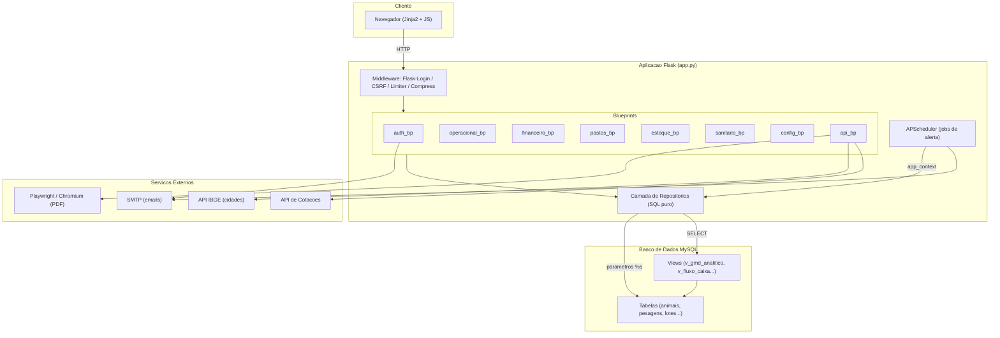
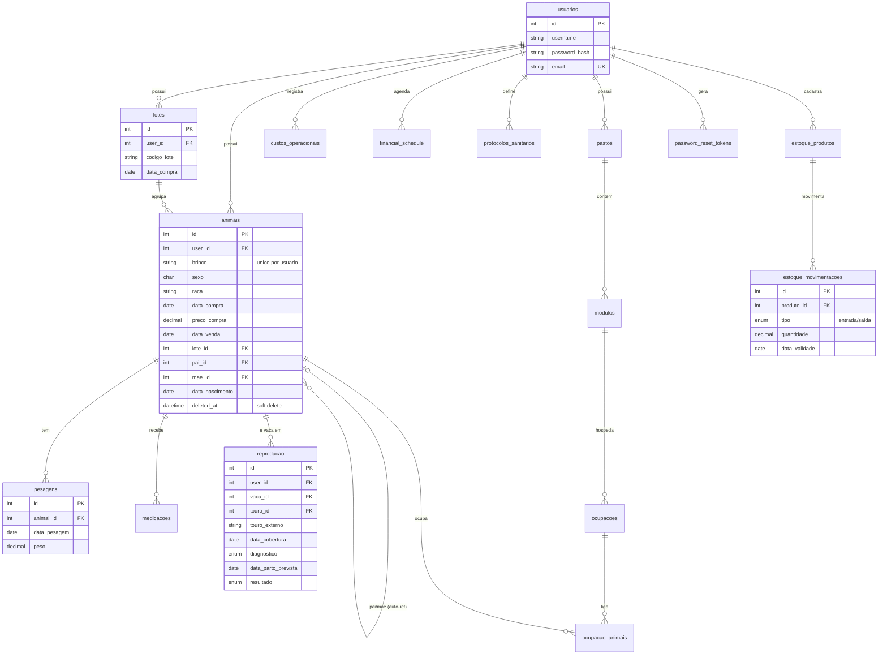
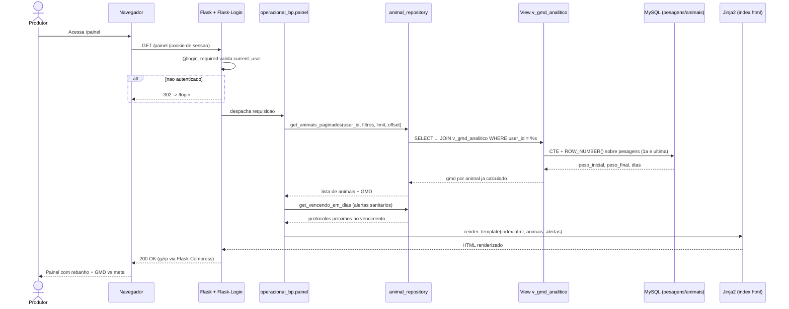

# Sistema de Gestão de Gado (SGG): Documentação Técnica

> ERP zootécnico multi-tenant para pecuária de corte. Flask + MySQL puro (sem ORM),
> com a lógica pesada de cálculo delegada ao banco de dados via *Views* SQL.

---

## 1. Visão Geral e Contexto

O **SGG** é um ERP web voltado à **pecuária de corte** (bovino de corte, não leite). Ele resolve um problema concreto do produtor rural: a gestão do rebanho ainda é feita, na maioria das fazendas, em cadernos e planilhas soltas, sem rastreabilidade nem indicadores confiáveis de desempenho.

A aplicação é um **SaaS multi-tenant**: cada `usuario` representa uma fazenda/operação isolada, e todo dado é segregado por `user_id`. Um produtor jamais enxerga o rebanho de outro.

### O que o sistema faz

| Domínio | Função de negócio |
|---|---|
| **Rebanho** | Cadastro de animais (individual ou em lote), pesagens, medicações, venda e exclusão lógica (lixeira). |
| **Zootecnia** | Cálculo do **GMD (Ganho Médio Diário)**, o KPI central da engorda, e comparação contra uma meta configurável. |
| **Financeiro** | Fluxo de caixa anual, **P&L por lote** ("esse lote deu lucro?"), contas a pagar e custos por centro de custo. |
| **Pastagens** | Gestão de pastos, módulos (piquetes), ocupação e taxa de lotação em UA (Unidade Animal). |
| **Reprodução** | Registro de cobertura, diagnóstico de prenhez (DG), previsão de parto (~285 dias) e criação automática do bezerro. |
| **Sanitário** | Protocolos vacinais recorrentes com alertas de vencimento. |
| **Estoque** | Livro-razão de medicamentos/insumos com controle de validade e estoque mínimo. |

### A lógica de negócio central: o GMD

O indicador que justifica o sistema é o **Ganho Médio Diário**:

```
GMD = (peso_final − peso_inicial) / dias_entre_pesagens
```

É a métrica que diz se o boi está engordando rápido o suficiente para ser vendido no ponto certo. Uma decisão de engenharia importante do projeto é que **o GMD nunca é calculado em Python**: ele é resolvido em SQL, com *window functions* sobre a tabela `pesagens`, filtrando por `user_id` antes das janelas por questão de performance (ver `v_gmd_analitico`).

Outro conceito de domínio que permeia o código é a **arroba** (@): unidade de precificação do mercado pecuário. Toda compra e venda passa por um único ponto de conversão em `utils/calculo.py`:

```
preco = (peso_kg / 30) * valor_arroba      # KG_POR_ARROBA = 30
```

---

## 2. Stack Tecnológica

| Camada | Tecnologia | Papel |
|---|---|---|
| **Linguagem** | Python 3.10+ | Base da aplicação. |
| **Web framework** | **Flask 3.1** | Núcleo HTTP, roteamento por Blueprints, Jinja2. |
| **Banco de dados** | **MySQL** (via `mysql-connector-python`) | Persistência. **SQL puro, sem ORM** (decisão deliberada). |
| **Migrations** | **yoyo-migrations** (SQL-first, via PyMySQL) | Schema versionado em `migrations/*.sql`. Sem ORM, sem autogenerate. |
| **Autenticação** | **Flask-Login** | Gestão de sessão e `current_user`. |
| **Segurança de forms** | **Flask-WTF** (`CSRFProtect`) | Proteção CSRF global. |
| **Rate limiting** | **Flask-Limiter** | Limite de requisições por rota (com Redis opcional em produção). |
| **Agendamento** | **APScheduler** | Jobs de alerta por email rodando dentro do processo Flask. |
| **Geração de PDF** | **Playwright** (Chromium headless) | Renderização de relatórios em PDF de forma assíncrona. |
| **Performance HTTP** | **Flask-Compress** | Compressão gzip das respostas. |
| **Hashing de senha** | **Werkzeug Security** | `generate_password_hash` / `check_password_hash`. |
| **Config** | **python-dotenv** | Variáveis sensíveis via `.env`, nunca hardcoded. |
| **Servidor de produção** | **Gunicorn** | WSGI server (deploy em Railway / Docker). |

> **Ausência intencional de ORM.** Toda a lógica de cálculo pesada (GMD, fluxo de caixa, P&L, ocupação de pasto) vive em *Views* SQL otimizadas. O Python orquestra; o banco calcula. Isso mantém as queries auditáveis, indexáveis e fora do domínio de N+1 típico de ORMs.

---

## 3. Arquitetura e Diagramas UML

### 3.1 Diagrama de Componentes / Arquitetura



**Fluxo:** o navegador fala apenas com a camada de *middleware* do Flask, que aplica autenticação (Flask-Login), proteção CSRF e *rate limiting* antes de qualquer rota. As requisições são despachadas para o **Blueprint** do domínio correspondente. Nenhuma rota escreve SQL diretamente: toda query passa pela **camada de repositórios**, que por sua vez lê das **Views** (para cálculos) ou das **tabelas** (para mutações), sempre com parâmetros `%s` e filtro por `user_id`. Serviços externos (SMTP, Playwright, APIs de IBGE e cotações) são acionados só quando necessário, e o **APScheduler** roda jobs de alerta dentro do próprio processo, abrindo `app.app_context()` para reutilizar os mesmos repositórios.

### 3.2 Diagrama Entidade-Relacionamento (ERD)



**Fluxo:** `usuarios` é a raiz de todo o *tenant*: praticamente toda tabela carrega um `user_id`. Um `animal` pertence a um `lote` (unidade de custo/P&L) e acumula `pesagens` (base do GMD) e `medicacoes` (base do custo sanitário). A tabela `animais` é **auto-referenciada** por `pai_id`/`mae_id` (`ON DELETE SET NULL`), modelando a hereditariedade. A relação animal↔módulo é **N:N** via a tabela associativa `ocupacao_animais`, que não tem `user_id` próprio, e o isolamento multi-tenant é garantido por JOIN em `modulos.user_id`. `reproducao` liga a vaca (e opcionalmente o touro interno) e, ao registrar parto vivo, dispara a criação automática de um novo `animal`.

### 3.3 Diagrama de Sequência: ciclo de vida do Dashboard com cálculo de GMD

O fluxo mais crítico do sistema: o produtor abre o painel do rebanho e o sistema precisa devolver a lista de animais **com o GMD de cada um calculado no banco**.



**Fluxo:** a requisição só chega à rota depois de passar pelo guard `@login_required`. A rota **não conhece SQL**: ela pede ao `animal_repository`, que consulta a *View* `v_gmd_analitico`. É dentro do banco que o trabalho pesado acontece: uma CTE com `ROW_NUMBER()` isola a primeira e a última pesagem de cada animal e calcula o GMD via `DATEDIFF`. O resultado já vem pronto, o repositório o devolve à rota, que agrega os alertas sanitários e delega a apresentação ao template Jinja2. A resposta final ainda é comprimida (gzip) antes de voltar ao navegador. Todo o caminho respeita o filtro por `user_id`, garantindo o isolamento multi-tenant.

---

## 4. Destaques Técnicos

### 4.1 Organização por Blueprints de domínio
A aplicação é fatiada em **8 Blueprints** (`auth`, `operacional`, `financeiro`, `pastos`, `estoque`, `sanitario`, `configuracoes`, `api`), registrados em `app.py`. Cada domínio é autocontido, o que mantém as rotas coesas e o acoplamento baixo.

### 4.2 Camada de repositórios: separação rígida rota ↔ SQL
Nenhuma query vive nas rotas. Existe um `repository` por domínio (`repositories/`), e essa é uma regra imposta no projeto. Isso torna as queries testáveis isoladamente (`tests/test_repositories.py`) e centraliza o cuidado com multi-tenancy.

### 4.3 Segurança em profundidade
- **Hashing de senha** com Werkzeug (`generate_password_hash` / `check_password_hash`), nunca em texto plano.
- **CSRF global** via Flask-WTF (`CSRFProtect`): todo formulário exige token.
- **Rate limiting** por rota (Flask-Limiter): login `10/min`, geração de PDF `6/min`, exports `10/min`, o que mitiga brute-force e abuso.
- **Headers de segurança** aplicados em `after_request`: `X-Content-Type-Options: nosniff`, `X-Frame-Options: SAMEORIGIN`, `Referrer-Policy`.
- **Recuperação de senha** via código de 6 dígitos com TTL de 15 min (`password_reset_tokens`).
- **Segredos** exclusivamente via `os.getenv()`, nunca hardcoded.

### 4.4 SQL parametrizado e à prova de injeção
Toda query usa *placeholders* `%s`; f-strings e `%` para montar SQL são explicitamente proibidos. Filtragem sempre feita no banco, nunca "trazer tudo para filtrar no Python".

### 4.5 Isolamento multi-tenant como invariante
Todo `SELECT` filtra por `user_id`. Onde não há coluna direta (`ocupacao_animais`), o isolamento é feito por JOIN em `modulos.user_id`. Há uma suíte dedicada a isso (`tests/test_tenant_isolation.py`).

### 4.6 Tratamento de erros e resiliência
- Acesso a banco via *context manager* `get_db_cursor()` com **commit/rollback automático**: mutações são atômicas por design.
- **Connection pool** MySQL com *fallback* gracioso para conexão direta se o pool falhar.
- Rotas envolvem o acesso a dados em `try/except` com log estruturado e mensagem amigável ao usuário via `flash`.

### 4.7 Processamento assíncrono sem broker externo (padrão job_id + polling)
Geração de PDF é lenta (Playwright + Chromium). Em vez de bloquear a requisição, a rota dispara uma `threading.Thread`, grava `.pending`/`.pdf`/`.error` em `/tmp` por `job_id`, e o cliente faz *polling* em `/status`. **Sem Celery, sem Redis, sem fila.** A complexidade só entra se for realmente necessária.

### 4.8 Cálculo delegado ao banco via Views
GMD (`v_gmd_analitico`), fluxo de caixa (`v_fluxo_caixa`), P&L por lote (`vw_resultado_lote`), ocupação de pasto (`vw_ocupacao_atual`) e saldo de estoque (`vw_saldo_estoque`) são **Views SQL** com CTEs e *window functions*. O saldo nunca é uma coluna materializada: é sempre `SUM(entrada) - SUM(saida)`, o que elimina o risco de dessincronização.

### 4.9 Jobs proativos in-process
`APScheduler` roda alertas (contas vencendo, protocolos, estoque crítico) dentro do processo Flask, com um *guard* cuidadoso em `app.py` para evitar disparo múltiplo sob vários workers do Gunicorn, cobrindo tanto `preload_app=True` quanto `False`.

### 4.10 Cobertura de testes
Suíte com **pytest** cobrindo autenticação, isolamento de tenant, financeiro, reprodução, estoque, sanitário, alertas e cálculo de GMD, além de testes **E2E com Playwright** (`tests/e2e/`).

### 4.11 Migrations versionadas (só-aditivas)
O schema vive em `migrations/*.sql`, aplicado por **yoyo-migrations** (SQL puro, sem ORM — ver `db_migrate.py`). `0001.baseline-schema` é o estado consolidado, escrito para ser *convergente* (`CREATE TABLE IF NOT EXISTS` / `CREATE OR REPLACE VIEW`): roda igual num banco vazio e num banco de produção já povoado, então o primeiro deploy não precisa de `yoyo mark`. yoyo registra o que já aplicou em `_yoyo_migration`. A política **só-aditiva** (#78) é imposta por teste (`tests/test_migrations.py`): nenhuma migration pode conter `DROP TABLE`/`DROP COLUMN`. `init_db.py` (o `preDeployCommand` do Railway) chama as migrations e depois faz o seed opcional do admin.

---

## 5. Camada de frontend e design system

O frontend não usa framework JavaScript. É Jinja2 renderizado no servidor, com um design system em CSS puro e alguns scripts para interações pontuais (dropdown, menu responsivo, polling do PDF, modais de confirmação).

### 5.1 Design system baseado em tokens

`static/css/design_system.css` define a identidade visual em CSS custom properties, sob uma estética que o próprio arquivo chama de "rústico-profissional". Os tokens ficam concentrados em `:root` e o resto da folha só os consome, então trocar a paleta ou a escala tipográfica é mexer em um lugar só:

- **Cores** em famílias: verde campo (`--color-primary` e variações), âmbar terra (`--color-accent`) e os semânticos `danger`/`success`/`warning`, cada um com sua variante de fundo.
- **Tipografia** com duas famílias: Fraunces para títulos (`--font-display`) e Inter para corpo (`--font-body`), mais escalas de tamanho (`--text-xs` a `--text-2xl`), peso e altura de linha.
- **Espaçamento** em escala fixa (`--space-1` a `--space-10`).

As fontes são **self-hosted** em `static/fonts/` (`.woff2`, subsets latin + latin-ext), declaradas em `static/css/fonts.css` com `font-display: swap`. Não há requisição a `fonts.googleapis.com`/`fonts.gstatic.com`: o IP do produtor não vaza para o Google e a CSP não precisa liberar host de terceiros para estilo/fonte. Para atualizar a versão: `scripts/vendor_fonts.sh`.

### 5.2 Biblioteca de componentes

`static/components.html` é um styleguide vivo: uma página que mostra cada componente renderizado com o CSS real. Cobre navegação, cabeçalho de página, cards de métrica, badges de status, tabela de animais, alertas, botões, formulários, card de módulo de pasto, gráficos ECharts, tags de contexto, o modal de confirmação (`sggConfirm`) e o toast inline (`sggToast`).

A rota `/styleguide` (em `app.py`) serve essa página, mas só quando `app.debug` está ligado; em produção responde 404. O CLAUDE.md torna a consulta obrigatória: antes de criar ou editar um template usa-se `/design-ui`, e para um componente novo, `/new-component`.

### 5.3 Layout único e navegação

`base.html` é o esqueleto que os 30 templates de página estendem via ``. Ele concentra a barra de navegação (com dropdown "+ Novo" e menu hambúrguer responsivo), o estado ativo do link atual calculado por `request.endpoint`, a área de mensagens `flash` e o carregamento de CSS e fontes. Os gráficos usam ECharts via CDN.

### 5.4 Filtros e context processors do Jinja2

Duas conversões recorrentes viram filtros, para não repetir formatação nos templates:

- `|brl` formata número como moeda brasileira (`1234.5` vira `1.234,50`).
- `|date_br` formata data como `dd/mm/aaaa`.

Dois context processors injetam dados globais em todo template: `nome_fazenda_header` e `gmd_meta`, lidos das configurações do usuário e guardados em `session` para evitar uma query por request; e `cache_bust`, a versão do deploy atual.

### 5.5 Cache de assets

Todo arquivo sob `/static/` recebe `Cache-Control: max-age=31536000` (um ano) via `after_request`. Para que uma versão nova não fique presa nesse cache, os links de CSS/JS levam `?v={{ cache_bust }}`: a cada deploy a URL muda e o navegador baixa o arquivo de novo.

`cache_bust` tenta, nessa ordem: `RAILWAY_GIT_COMMIT_SHA` (variável que a Railway injeta — o build via nixpacks não deixa o `.git` disponível em runtime, então `git rev-parse` não funciona em produção), depois `git rev-parse --short HEAD` (cobre o dev local), e por fim o horário de start do processo. O fallback já foi uma string fixa (`'0'`): sem `.git` em produção, `cache_bust` nunca mudava entre deploys, o cache de 1 ano prendia o navegador numa versão velha de CSS/JS indefinidamente enquanto o HTML (nunca cacheado) já era o novo — descompasso silencioso, sem erro de console. Macros repetíveis, como a paginação, ficam em `templates/_macros.html`.

---

## 6. Guia de Execução Local

### Pré-requisitos
- Python 3.10+
- MySQL 5.7+ / 8.x rodando localmente

### Passo a passo

```bash
# 1. Clonar e entrar no diretório
git clone <repo-url> sistema_gado
cd sistema_gado

# 2. Criar e ativar o ambiente virtual
python -m venv venv
source venv/bin/activate        # Linux/macOS
# venv\Scripts\activate         # Windows

# 3. Instalar as dependências
pip install -r requirements.txt

# 4. Instalar o navegador do Playwright (necessário para gerar PDF)
playwright install chromium

# 5. Configurar variáveis de ambiente
cp .env-example .env
#   edite o .env preenchendo, no mínimo:
#   SECRET_KEY, DB_HOST, DB_USER, DB_PASSWORD, DB_NAME, DB_PORT
#   (MAIL_* são opcionais, só necessários para emails/reset de senha)

# 6. Inicializar o banco (aplica as migrations de migrations/*.sql + seed do admin)
python init_db.py
#   equivale a `python db_migrate.py` (schema) seguido do seed opcional do admin

# 7. Rodar em modo de desenvolvimento
python app.py
#   Acesse http://localhost:5000
```

### Variáveis de ambiente essenciais (`.env`)

| Variável | Descrição |
|---|---|
| `SECRET_KEY` | Chave de sessão do Flask (obrigatória). |
| `DB_HOST` / `DB_PORT` | Host e porta do MySQL. |
| `DB_USER` / `DB_PASSWORD` / `DB_NAME` | Credenciais e nome do banco. |
| `DB_POOL_SIZE` | Tamanho do pool de conexões (padrão 5). |
| `FLASK_DEBUG` | `True` para modo dev. |
| `PORT` | Porta do servidor (padrão 5000). |
| `MAIL_USERNAME` / `MAIL_PASSWORD` | SMTP opcional; habilita emails e reset de senha. |
| `REDIS_URL` | Opcional; storage do rate limiter em produção multi-worker. |

### Rodar em produção

```bash
gunicorn app:app
```

### Rodar os testes

Exige um MySQL local com o usuário de teste:

```sql
CREATE USER 'gado_test'@'localhost' IDENTIFIED BY 'gado123';
GRANT ALL PRIVILEGES ON sistema_gado_test.* TO 'gado_test'@'localhost';
```

```bash
pytest tests/                              # todos os testes
pytest tests/test_auth.py                  # arquivo específico
pytest tests/test_auth.py::test_login_sucesso   # teste único
```

O banco `sistema_gado_test` é criado e destruído automaticamente a cada sessão (ver `conftest.py`).

---

## 7. Sobre o Autor

Este projeto foi desenvolvido por **Davi Domingos De Oliveira**, estudante de **Ciência da Computação na Universidade Federal de Alagoas (UFAL)**.

O SGG foi construído com atenção à estrutura do código, não só às funcionalidades. As rotas não escrevem SQL: elas passam por uma camada de repositórios, que consulta Views onde o cálculo pesado acontece. Todo `SELECT` filtra por `user_id`, e há uma suíte de testes só para provar que um tenant não vê os dados de outro. As senhas usam hashing do Werkzeug, os formulários exigem token CSRF, as rotas sensíveis têm rate limiting e nenhuma query é montada por concatenação de string.

Foram decisões tomadas de propósito, e cada uma tem um motivo que dá para explicar: por que não usar ORM, por que o GMD é calculado em SQL e não em Python, por que o scheduler roda dentro do processo Flask em vez de exigir um broker externo. É esse tipo de raciocínio de engenharia que o projeto pretende demonstrar.
