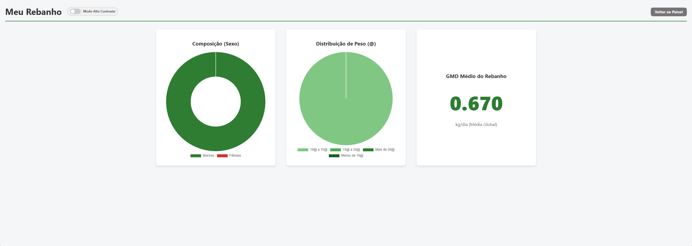

# 🐮 Sistema de Gestão de Gado (SGG) - High Performance Backend


> **Um ERP Zootécnico focado em performance, utilizando a inteligência do Banco de Dados para cálculos complexos.**

O **SGG** é uma solução web para resolver a dor de cabeça do pecuarista: o cálculo do GMD (Ganho Médio Diário) e o controle de Fluxo de Caixa real. Diferente de sistemas tradicionais que processam tudo no backend (Python), este projeto delega a lógica pesada para o **MySQL**, garantindo escalabilidade.

---

## 📸 Visão Geral do Sistema

### 1. Dashboard Financeiro (Fluxo de Caixa)
*Visão consolidada de entradas, saídas e custos operacionais, calculados via View SQL.*


### 2. Análise Zootécnica (GMD)
*Cálculo automático de ganho de peso diário baseado no histórico de pesagens.*


### 3. Analytics do Rebanho
*Distribuição de peso e sexo do rebanho em tempo real.*


---

## 🚀 Diferenciais de Engenharia (Backend)

Este projeto foi desenhado com princípios de **Performance-First**. Abaixo, os destaques técnicos:

### 🧠 1. Inteligência no Banco de Dados (Views SQL)
Ao invés de carregar milhares de registros para o Python somar, criei **Views Otimizadas**. O banco entrega o dado pronto (O(1) para a aplicação).

* **`v_gmd_analitico`**: Cruza a primeira e a última pesagem de cada animal para calcular o GMD exato, dias de cocho e ganho total.
* **`v_fluxo_caixa`**: Unifica 4 tabelas (Vendas, Compras, Medicações, Custos Fixos) em uma única visão financeira anual.

### ⚡ 2. Performance e Otimização
* **Server-Side Pagination:** O painel principal carrega apenas o necessário (LIMIT/OFFSET), permitindo escalar para milhares de animais sem travar o navegador.
* **Índices Estratégicos:** Criação de índices compostos (`idx_pesagens_otimizada`, `idx_custos_busca`) para garantir que as buscas e filtros sejam instantâneos.

### 🛡️ 3. Segurança e Arquitetura
* **MVC:** Separação clara entre Rotas, Templates e Banco de Dados.
* **Hash de Senha:** Implementação de segurança com `Werkzeug Security`.
* **Proteção de Rotas:** Decorators `@login_required` e validação de propriedade (Multi-tenant ready).

---

## 🛠️ Tecnologias Utilizadas

* **Linguagem:** Python 3.10
* **Framework Web:** Flask
* **Banco de Dados:** MySQL 8.0 (com Connector/Python Pooling)
* **Frontend:** HTML5, CSS3 (Responsivo), Chart.js
* **Infra/Deploy:** Pronto para Docker/Nuvem (Aiven/AWS)

---

## ⚙️ Instalação e Execução

### Pré-requisitos
* Python 3.10+
* MySQL Server rodando localmente ou na nuvem.

### 1. Clone e Prepare o Ambiente
```bash
git clone [https://github.com/dom1ng0s/sistema_gado.git](https://github.com/dom1ng0s/sistema_gado.git)
cd sistema_gado

# Criar ambiente virtual
python -m venv venv
# Ativar (Windows)
venv\Scripts\activate
# Ativar (Linux/Mac)
source venv/bin/activate
````

### 2\. Instale as Dependências

```bash
pip install -r requirements.txt
```

### 3\. Configuração (.env)

Crie um arquivo `.env` na raiz com suas credenciais:

```ini
DB_HOST=localhost
DB_USER=root
DB_PASSWORD=sua_senha
DB_NAME=sistema_gado
DB_PORT=3306
SECRET_KEY=sua_chave_secreta
```

### 4\. Inicialização do Banco (Migrations)

Execute o script que cria as Tabelas, Views e Índices:

```bash
python init_db.py
```

### 5\. (Opcional) Popular com Dados de Teste

Para ver o dashboard bonito como nos prints, rode o script de seed que gera dados realistas:

```bash
python seed_db.py
```

### 6\. Execute

```bash
python app.py
```

Acesse: `http://localhost:5000`

-----

## 📞 Contato

**Davi Domingos** - *Backend Developer*

  * [LinkedIn](https://www.google.com/search?q=https://www.linkedin.com/in/davi-domingos-oli)
  * [GitHub](https://www.google.com/search?q=https://github.com/dom1ng0s)
  * Email: odomingosdavi@gmail.com

<!-- end list -->

````

---
