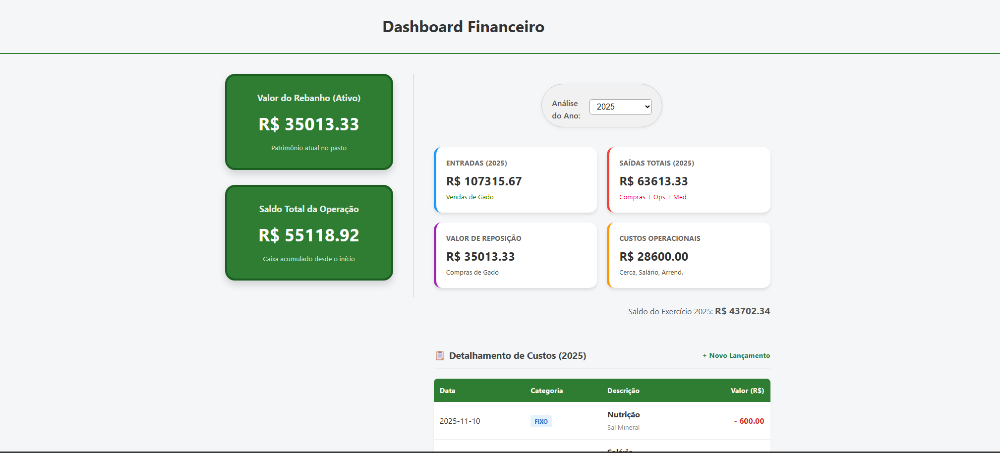
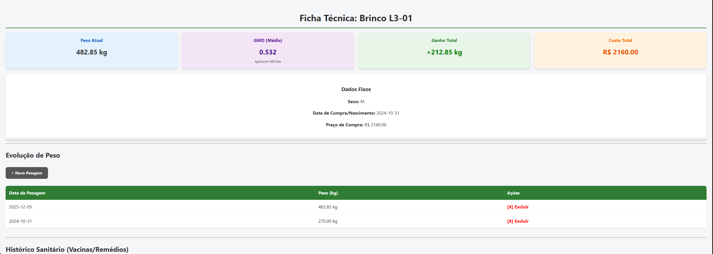
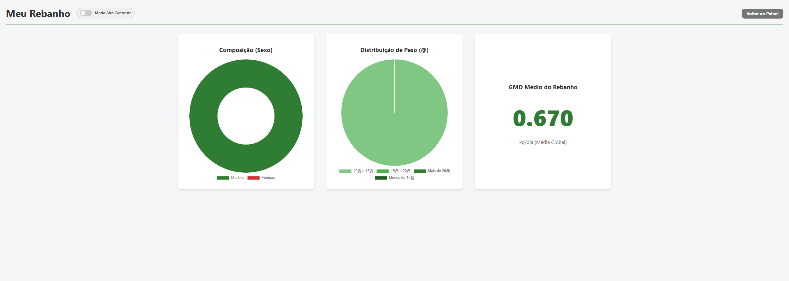
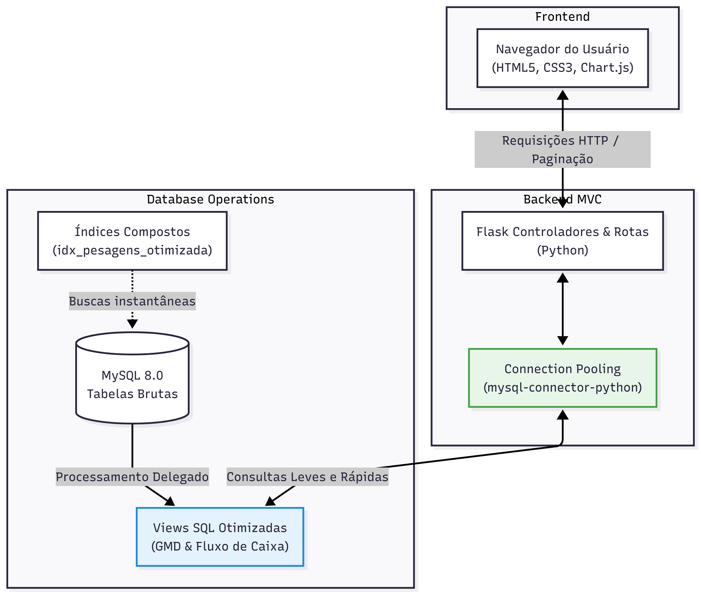

### 🐮 Sistema de Gestão de Gado (SGG)
**ERP Zootécnico de alta performance para o agronegócio**

Solução web para pecuaristas que precisam controlar rebanho, calcular **GMD (Ganho Médio Diário)** e acompanhar o **fluxo de caixa** da fazenda — tudo em um só lugar, com lógica de cálculo delegada ao banco de dados para máxima performance, **reduzindo análises que levavam horas para cerca de 3 minutos**.

--------------------------------------------------------------------------------

#### 📸 Capturas de Tela
| Dashboard Financeiro | Análise Zootécnica (GMD) | Analytics do Rebanho |
| ------ | ------ | ------ |
|  |  |  |
| *Fluxo de caixa consolidado via View SQL* | *GMD calculado a partir do histórico de pesagens* | *Distribuição de peso e sexo em tempo real* |

--------------------------------------------------------------------------------

#### 💡 O Problema que Este Projeto Resolve
Produtores rurais dependem de dois indicadores críticos que sistemas genéricos não calculam bem:
*   **GMD (Ganho Médio Diário):** quanto cada animal está ganhando de peso por dia. Calculado cruzando a primeira e a última pesagem do histórico — operação custosa se feita no Python, leve se feita no banco.
*   **Fluxo de Caixa Real:** receitas e despesas da fazenda unificadas (compra/venda de gado, medicações, custos fixos) em uma única visão financeira anual.

O SGG resolve isso com uma abordagem **Performance-First**: a lógica pesada fica no MySQL, e o Python apenas serve o resultado.

--------------------------------------------------------------------------------

#### 🏗️ Arquitetura e Decisões Técnicas



##### 🧠 Inteligência no Banco de Dados (Views SQL)
Em vez de trazer todos os registros para o Python calcular, o SGG usa **Views otimizadas** — o banco entrega o dado agregado pronto, com custo O(1) para a aplicação:

##### ⚡ Escalabilidade sem Travar o Navegador
*   **Server-Side Pagination:** o painel principal usa LIMIT/OFFSET no banco — funciona mesmo com milhares de animais cadastrados.
*   **Índices Compostos:** `idx_pesagens_otimizada` e `idx_custos_busca` garantem buscas e filtros instantâneos à medida que o rebanho cresce.
*   **Connection Pooling:** uso do `mysql-connector-python` com pool de conexões para evitar overhead de reconexão a cada request.

##### 🛡️ Segurança e Boas Práticas
*   **Arquitetura MVC** com separação clara entre Rotas (`/routes`), Templates (`/templates`) e camada de dados (`models.py`, `db_config.py`).
*   **Hash de senha** com Werkzeug Security (`generate_password_hash` / `check_password_hash`).
*   **Proteção de rotas** via `@login_required` e validação de propriedade dos dados (multi-tenant ready).
*   **Variáveis sensíveis** isoladas em `.env` (nunca commitadas).
*   **Testes automatizados** com pytest e `conftest.py` para fixtures de banco.

--------------------------------------------------------------------------------

#### 🛠️ Stack Tecnológica
| Camada | Tecnologia |
| ------ | ------ |
| **Linguagem** | Python 3.10+ |
| **Framework Web** | Flask |
| **Banco de Dados** | MySQL 8.0 |
| **ORM / Queries** | MySQL Connector/Python (SQL puro + Views) |
| **Frontend** | HTML5, CSS3 responsivo, Chart.js |
| **Testes** | Pytest |
| **Segurança** | Werkzeug Security |
| **Config** | python-dotenv |

--------------------------------------------------------------------------------

#### ⚙️ Como Rodar Localmente
##### Pré-requisitos
*  Python 3.10+
*  MySQL Server (local ou na nuvem — testado no Aiven)

##### 1. Clone o repositório
```bash
git clone https://github.com/Dom1ng0s/sistema_gado.git
cd sistema_gado
```

##### 2. Crie e ative o ambiente virtual
```bash
python -m venv venv
source venv/bin/activate  # ou venv\Scripts\activate no Windows
```

##### 3. Instale as dependências
```bash
pip install -r requirements.txt
```

##### 4. Configure o ambiente
Crie um arquivo `.env` na raiz do projeto baseado no `.env-example`.

##### 5. Inicialize o banco de dados
Este script cria todas as tabelas, Views e índices automaticamente:
```bash
python init_db.py
```

##### 6. (Opcional) Popule com dados de demonstração
Para ver o dashboard com dados realistas:
```bash
python seed_db.py
```

##### 7. Execute a aplicação
```bash
flask run
```
Acesse em: **http://localhost:5000**

--------------------------------------------------------------------------------

#### 🧪 Executando os Testes
```bash
pytest
```

--------------------------------------------------------------------------------

#### 📁 Estrutura do Projeto

--------------------------------------------------------------------------------

#### 🗺️ Próximas Funcionalidades
*  [ ] API REST para integração com aplicativo mobile
*  [ ] Exportação de relatórios em PDF
*  [ ] Deploy com Docker + CI/CD via GitHub Actions
*  [ ] Dashboard de alertas (animais abaixo do GMD esperado)

--------------------------------------------------------------------------------

#### 👤 Autor
**Davi Domingos de Oliveira**  Estudante de Ciência da Computação — UFAL | Backend Developer
