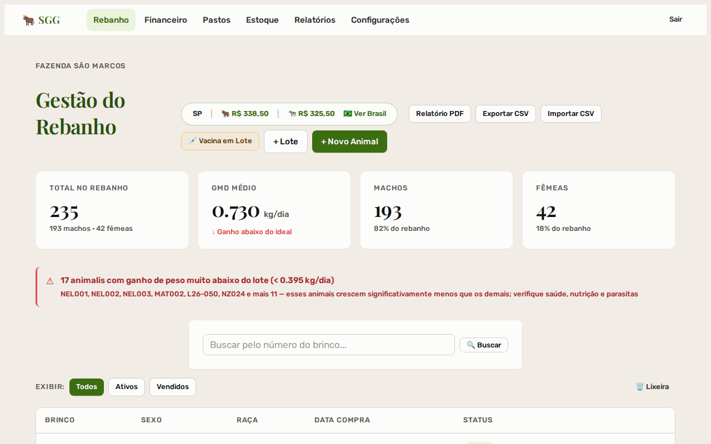
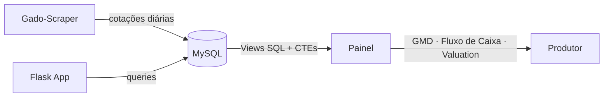

# 🐮 Sistema de Gestão de Gado

[](https://sistemadogado.up.railway.app)
[](https://python.org)
[](https://flask.palletsprojects.com)
[](https://mysql.com)
[](LICENSE)

Pecuaristas controlavam rebanho em planilha e tomavam decisões de compra e venda sem saber o GMD real de cada animal. O SGG centraliza rebanho, fluxo de caixa e cotações do dia num único sistema web, com os cálculos pesados rodando direto no MySQL via views SQL.

**Demo ao vivo:** [sistemadogado.up.railway.app](https://sistemadogado.up.railway.app)
Login: `demonstracao` / `demonstracao`

## Demo



## Por que esse sistema existe

Gado de corte é um ativo de R$ 1.800 a R$ 2.000 por cabeça. Com 235 animais, o rebanho da Fazenda São Marcos representa R$ 433.640,87 de patrimônio em campo. Até o sistema entrar em produção, o controle era feito em planilhas que não calculavam GMD nem cruzavam as pesagens com o fluxo de caixa.

O problema concreto: o produtor não sabia quais animais estavam crescendo abaixo do esperado. O sistema hoje aponta 17 animais com GMD abaixo de 0,395 kg/dia e lista os brincos imediatamente. Sem rastreamento individual, esses animais passariam meses consumindo pasto e suplemento sem retorno.

## Arquitetura


```mermaid
graph LR
    A[Gado-Scraper] -->|cotações diárias| B[(MySQL)]
    C[Flask App] -->|queries| B
    B -->|Views SQL + CTEs| D[Painel]
    D -->|GMD · Fluxo de Caixa · Valuation| E[Produtor]
```

## Por que views SQL em vez de ORM

O GMD de um animal é calculado com `LAG()` sobre o histórico de pesagens, comparando cada pesagem com a anterior e dividindo pelo intervalo de dias. Fazer isso no Python significa trazer todas as pesagens para a memória, iterar, e calcular por animal. Fazer no banco significa uma única query com CTE + window function que retorna o resultado pronto.

A view `v_gmd_analitico` usa essa abordagem. A rota recebe o dado calculado, sem processar nada no servidor Flask. O mesmo princípio vale para `v_fluxo_caixa` (consolida compras, vendas, custos operacionais e medicações num único `UNION`) e para as 6 outras views do sistema.

Introduzir ORM aqui seria trocar uma query de 40 linhas por 10 chamadas de método que geram SQL equivalente, mas menos legível e mais difícil de otimizar com índices específicos.

## Métricas reais (Fazenda São Marcos, demo)

| Indicador | Valor |
|---|---|
| Animais no rebanho | 235 (193 machos, 42 fêmeas) |
| GMD médio do rebanho | 0,730 kg/dia |
| Animais abaixo do GMD mínimo | 17 (< 0,395 kg/dia) |
| Valor do rebanho ativo | R$ 433.640,87 |
| Custo de produção | R$ 102,52/@ |
| Custo diário por cabeça | R$ 2,50/cab |
| Cotação SP hoje (boi gordo) | R$ 338,50/@ |
| Praças monitoradas via scraper | 33 |

## Stack

| Tecnologia | Por que foi escolhida |
|---|---|
| Flask | Sem overhead de ORM; SQL puro via views era o requisito central |
| MySQL 8.0 | Window functions (`LAG`, `ROW_NUMBER`) para o cálculo de GMD |
| Playwright | Geração de PDF server-side sem dependência de biblioteca de layout |
| Railway | Deploy de container com MySQL gerenciado no mesmo provedor |
| Flask-Limiter | Rate limiting em rotas de login e export sem middleware externo |

## Como rodar localmente

```bash
git clone https://github.com/Dom1ng0s/sistema_gado.git
cd sistema_gado
python -m venv venv && source venv/bin/activate
pip install -r requirements.txt
playwright install chromium

# configure .env a partir de .env-example
python init_db.py          # cria tabelas, views e índices
python seed_db.py          # popula com dados demo (opcional)
python app.py
```

Acesse em `http://localhost:5000`. Login padrão após seed: `admin` / `admin123`.

## Estrutura de banco

O banco não armazena dados brutos para o Python calcular. Cada view encapsula uma computação:

| View | O que calcula |
|---|---|
| `v_gmd_analitico` | GMD por animal via CTE + window functions |
| `v_fluxo_caixa` | Fluxo anual consolidado (compras, vendas, custos, medicações) |
| `vw_ocupacao_atual` | Módulos de pasto com lotação em UA e percentual de capacidade |
| `vw_gmd_por_touro` | Ranking de touros por GMD médio dos filhos |
| `vw_saldo_estoque` | Saldo de estoque com flag de mínimo atingido |

## Testes

```bash
# requer MySQL local com usuário gado_test/gado123
pytest
pytest tests/test_tenant_isolation.py   # verifica isolamento multi-tenant por HTTP
```

Os testes de `test_tenant_isolation.py` verificam em nível HTTP que um usuário não consegue visualizar, vender, pesar, medicar ou excluir animais de outro usuário.

## Licença

MIT

---

**Davi Domingos de Oliveira**
Ciência da Computação, UFAL

[](https://www.linkedin.com/in/davidomingosdeoliveira/)
[](https://github.com/Dom1ng0s)
