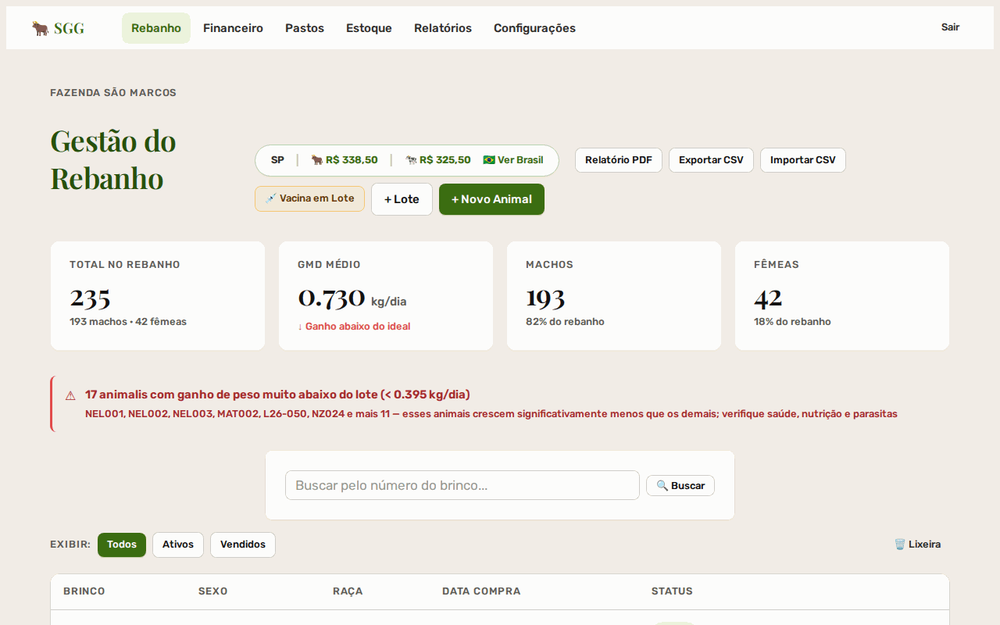
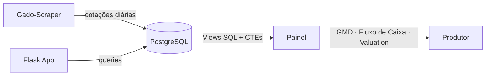

# 🐮 Sistema de Gestão de Gado

[](https://sistemadogado.up.railway.app)
[](https://python.org)
[](https://flask.palletsprojects.com)
[](https://postgresql.org)
[](LICENSE)

Pecuaristas controlavam rebanho em planilha e tomavam decisões de compra e venda sem saber o GMD real de cada animal. O SGG centraliza rebanho, fluxo de caixa e cotações do dia num único sistema web, com os cálculos pesados rodando direto no PostgreSQL via views (e materialized views) SQL.

**Demo ao vivo:** [sistemadogado.up.railway.app](https://sistemadogado.up.railway.app)
Login: `demonstracao` / `demonstracao`

## Demo



## Por que esse sistema existe

Gado de corte é um ativo de R$ 1.800 a R$ 2.000 por cabeça. Com 235 animais, o rebanho da Fazenda São Marcos representa R$ 433.640,87 de patrimônio em campo. Até o sistema entrar em produção, o controle era feito em planilhas que não calculavam GMD nem cruzavam as pesagens com o fluxo de caixa.

O problema concreto: o produtor não sabia quais animais estavam crescendo abaixo do esperado. O sistema hoje aponta 17 animais com GMD abaixo de 0,395 kg/dia e lista os brincos imediatamente. Sem rastreamento individual, esses animais passariam meses consumindo pasto e suplemento sem retorno.

## Arquitetura


```mermaid
graph LR
    A[Gado-Scraper] -->|cotações diárias| B[(PostgreSQL)]
    C[Flask App] -->|queries| B
    B -->|Views SQL + CTEs| D[Painel]
    D -->|GMD · Fluxo de Caixa · Valuation| E[Produtor]
```

## Por que views SQL em vez de ORM

O GMD de um animal é calculado com `LAG()` sobre o histórico de pesagens, comparando cada pesagem com a anterior e dividindo pelo intervalo de dias. Fazer isso no Python significa trazer todas as pesagens para a memória, iterar, e calcular por animal. Fazer no banco significa uma única query com CTE + window function que retorna o resultado pronto.

A view `v_gmd_analitico` usa essa abordagem. A rota recebe o dado calculado, sem processar nada no servidor Flask. O mesmo princípio vale para `v_fluxo_caixa` (consolida compras, vendas, custos operacionais e medicações num único `UNION`) e para as 6 outras views do sistema.

Introduzir ORM aqui seria trocar uma query de 40 linhas por 10 chamadas de método que geram SQL equivalente, mas menos legível e mais difícil de otimizar com índices específicos.

## Métricas reais (Fazenda São Marcos, demo)

| Indicador | Valor |
|---|---|
| Animais no rebanho | 235 (193 machos, 42 fêmeas) |
| GMD médio do rebanho | 0,730 kg/dia |
| Animais abaixo do GMD mínimo | 17 (< 0,395 kg/dia) |
| Valor do rebanho ativo | R$ 433.640,87 |
| Custo de produção | R$ 102,52/@ |
| Custo diário por cabeça | R$ 2,50/cab |
| Cotação SP hoje (boi gordo) | R$ 338,50/@ |
| Praças monitoradas via scraper | 33 |

## Stack

| Tecnologia | Por que foi escolhida |
|---|---|
| Flask | Sem overhead de ORM; SQL puro via views era o requisito central |
| PostgreSQL 16 | Window functions para o GMD + `MATERIALIZED VIEW` para os cálculos pesados (#115) |
| Playwright | Geração de PDF server-side sem dependência de biblioteca de layout |
| Railway | Deploy de container com PostgreSQL gerenciado no mesmo provedor |
| Flask-Limiter | Rate limiting em rotas de login e export sem middleware externo |

## Como rodar localmente

```bash
git clone https://github.com/Dom1ng0s/sistema_gado.git
cd sistema_gado
python -m venv venv && source venv/bin/activate
pip install -r requirements.txt
playwright install chromium

docker compose up -d postgres   # PostgreSQL local (ver docker-compose.yml)

# configure .env a partir de .env-example
python init_db.py          # aplica migrations/*.sql (schema) + seed do admin
python scripts/demo/seed_demo_historico.py  # popula com dados demo (opcional)
python app.py
```

Acesse em `http://localhost:5000`. Login padrão após seed: `admin` / `admin123`.

## Estrutura de banco

O banco não armazena dados brutos para o Python calcular. Cada view encapsula uma computação:

| View | O que calcula |
|---|---|
| `v_gmd_analitico` * | GMD por animal (materialized view — #115) |
| `v_fluxo_caixa` * | Fluxo anual consolidado (materialized view) |
| `vw_ocupacao_atual` | Módulos de pasto com lotação em UA e percentual de capacidade |
| `vw_resultado_lote` * | P&L por lote (materialized view) |

`*` materialized views: atualizadas a cada 5 min por um job do APScheduler (`utils/matviews.py`). O painel/financeiro podem ficar até ~5 min defasados de uma pesagem ou lançamento novo.
| `vw_saldo_estoque` | Saldo de estoque com flag de mínimo atingido |

### Migrações de schema — `yoyo-migrations`, política só-aditiva

O schema vive em `migrations/*.sql` e é aplicado por **yoyo-migrations** (SQL puro,
sem ORM — ver `db_migrate.py`). O `preDeployCommand` do `railway.toml` roda
`python -u init_db.py`, que aplica as migrations pendentes e faz o seed opcional do admin.

```bash
python db_migrate.py            # aplica migrations pendentes (usa DB_* do .env)
python db_migrate.py --list     # migrations e status
python db_migrate.py --rollback # desfaz a última (se tiver .rollback.sql)
yoyo new -m "descrição"         # cria migrations/NNNN.descrição.sql
```

- **`0001.baseline-schema`** é o estado consolidado, escrito para ser *convergente*
  (`CREATE TABLE IF NOT EXISTS` / `CREATE OR REPLACE VIEW`): roda igual num banco
  vazio e num banco de produção já povoado — o primeiro deploy **não** precisa de `yoyo mark`.
- Política **só-aditiva** (#78), imposta por `tests/test_migrations.py`: nenhuma
  migration pode conter `DROP TABLE` / `DROP COLUMN`. Renomear, mudar tipo ou
  `NOT NULL` sem default em tabela populada exige uma migration de transição
  (adiciona o novo, faz backfill, mantém o antigo) — nunca um `DROP` direto.
- Dialeto **PostgreSQL 16** (`GENERATED AS IDENTITY`, `timestamptz`, `CHECK` no lugar de `ENUM`).

## Testes

### Testes unitários e de integração

```bash
# requer PostgreSQL local (docker compose up -d postgres)
pytest
pytest tests/test_tenant_isolation.py   # verifica isolamento multi-tenant por HTTP
```

Os testes de `test_tenant_isolation.py` verificam em nível HTTP que um usuário não consegue visualizar, vender, pesar, medicar ou excluir animais de outro usuário.

### Testes E2E (Playwright)

Os testes E2E em `tests/e2e/` cobrem os 3 fluxos mais frágeis do sistema com um browser real como linha de base de regressão: login, cadastro em lote e pesagem em lote.

**Pré-requisitos:**

```bash
# 1. Instalar browser (já incluso no requirements.txt, só precisa do browser)
playwright install chromium

# 2. PostgreSQL local com um superusuário (docker-compose já cria o usuário `gado`).
#    Os testes criam/destroem os bancos sistema_gado_test e sistema_gado_e2e.
docker compose up -d postgres
```

**Executar:**

```bash
# Todos os testes E2E
pytest tests/e2e/ -v

# Arquivo específico
pytest tests/e2e/test_login.py -v
pytest tests/e2e/test_cadastro_lote.py -v
pytest tests/e2e/test_pesagem_lote.py -v
```

Os testes E2E criam e destroem o banco `sistema_gado_e2e` automaticamente a cada sessão. O servidor Flask sobe na porta **5099** durante os testes — certifique-se de que está livre.

**Variáveis de ambiente opcionais** (mesmas dos testes unitários):

| Variável | Padrão |
|---|---|
| `TEST_DB_HOST` | `localhost` |
| `TEST_DB_USER` | `gado` |
| `TEST_DB_PASSWORD` | `gado123` |
| `TEST_DB_PORT` | `5432` |

## Licença

MIT

---

**Davi Domingos de Oliveira**
Ciência da Computação, UFAL

[](https://www.linkedin.com/in/davidomingosdeoliveira/)
[](https://github.com/Dom1ng0s)
